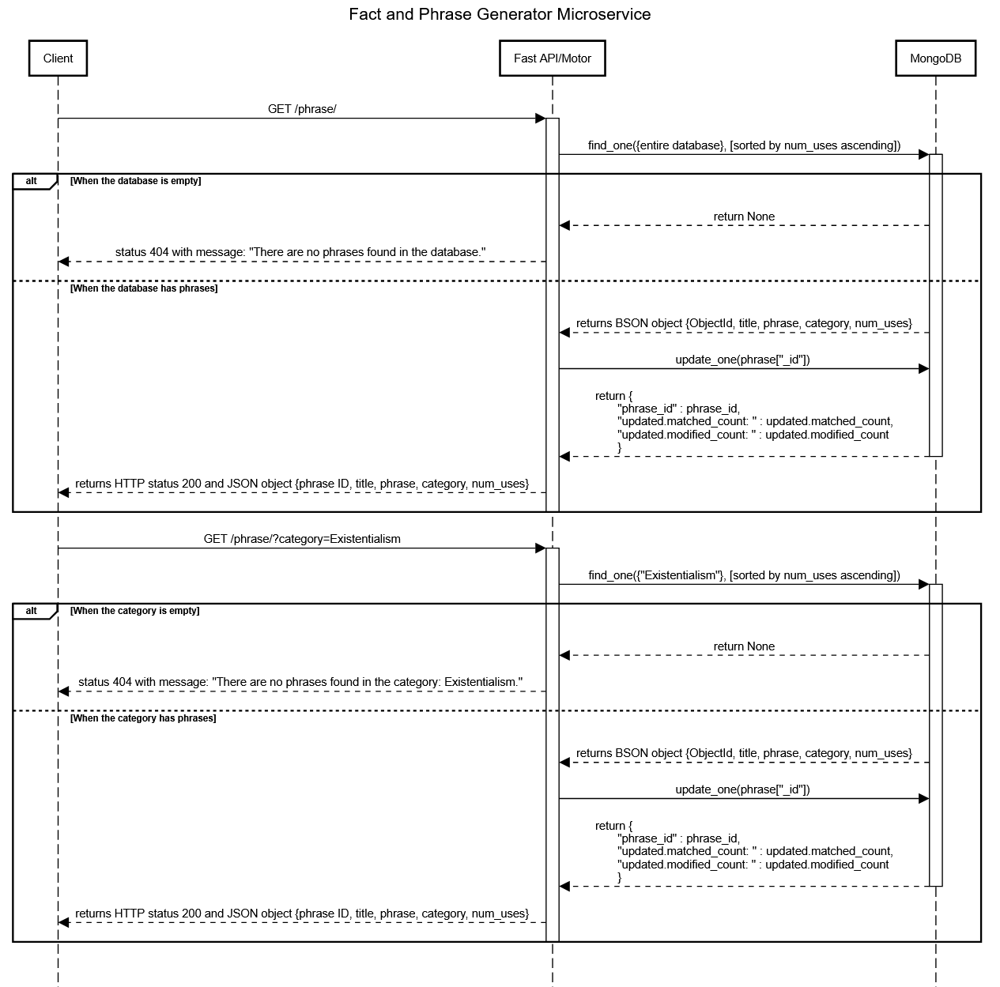

# CS361_Fact_And_Phrase_Generator_Microservice
## Description
This microservice accesses a database of facts and phrases stored on MongoDB. Client programs can make API requests to the service to receive either a random string from the entire database or a random string from within a specific category within the database. The microservice counts the number of times each string has been returned and prioritizes those that have been returned less often.

## Requesting Data
To request a fact or phrase, make an HTTP GET request to the /phrase/ endpoint. You can append an optional category query parameter to filter the results. If no category is provided, it retrieves the least-used phrase across all categories.
Example call: Will need the Render url where it is hosted

You can simply paste either of these urls into your address bar to quickly test the application:
```
https://cs361-fact-and-phrase-generator.onrender.com/phrase/?category=space
https://cs361-fact-and-phrase-generator.onrender.com/phrase/
```
Or programmatically (python):
```
import requests
# Request a phrase from the 'space' category
response = requests.get("https://cs361-fact-and-phrase-generator.onrender.com/phrase/?category=space")
```
## Receiving Data
Once you have received a response, you can parse the phrase from the json file. You can also simply view the entire JSON object as seen below (python):
```
data = response.json()
print(data)
```
The resulting output should look similar to this:
```
{
  "_id": "64abcdef1234567890",
  "title": "Massive Sun",
  "phrase": "The sun makes up more than 99 percent of the mass in our solar system.",
  "category": "space",
  "num_uses": 1
}
```
If there are no facts for that category, you will receive this:
```
{
  "detail": "There are no phrases found for the category: Biolog."
}
```
## UML Sequence Diagram
Show how requesting and receiving data works. Make it detailed enough that your teammates (and your grader) will understand.


